# AlWAYS WATCHING...
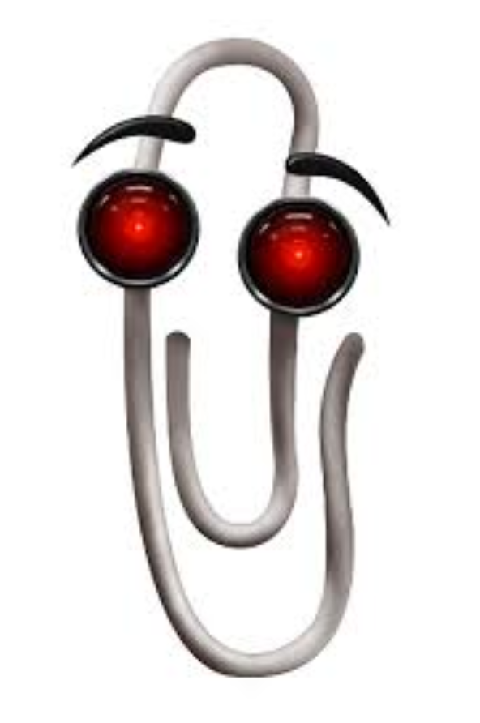

## Concept Design

## Goal and Audience

The goal of our exploration device is to bring innovative and unique solutions to already existing problems to make them stand out while improving efficiency for those using it. Our solution would also have to adhere to the course requirements. We plan on making our device easy to deploy and operate while making it inexpensive to purchase and operate. 

Our audience are first responders, scientists, researchers, the military, and the people responsible for purchasing exploration robots in all of those fields. Focusing on these professions allows us to choose from a wide variety of robots that meets our class requirements. 

## Idea Generation

To generate ideas and features, we came up with 4 broad categories that we could fill up (Figure 1). These include Sensors; Movement/Power; Asthetics, User Attention & Human Control; and Communication. We felt like these categories did a good job of encompassing the features of an exploration device.  

We used the software Lucidchart/Lucidspark as a whiteboard tool to display our brainstormed ideas, because this software is easy to collaborate remotely and has many different formats and tools in which ideas can be displayed.

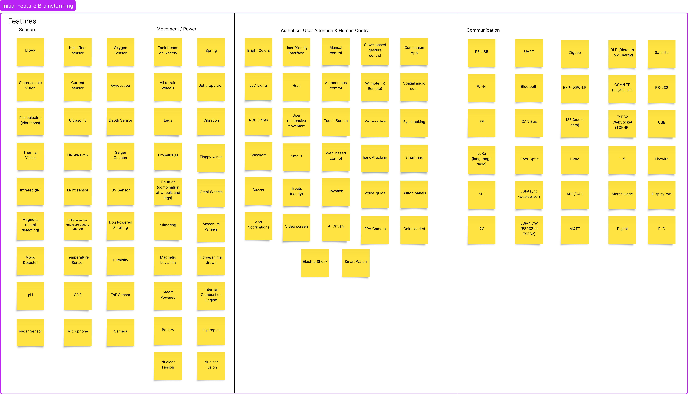
**Figure 1** Whiteboard of initial feature brainstorming

## Sorting and Ranking

Once the general brainstorming of features and ideas was complete. We figured that the 4 broad categories chosen at the start weren't enough to show each part necessary to make a functioning exploration device. To solve this, we divide the 4 categories we had into 7 new ones (Figure 2-8). These are User Interface and Control; Communication Technologies; Detection & Measurement; Navigation & Hazard Avoidance; Movement Mechanics; Power Sources; and Audio & Visual Features. 

After moving our features into the new categories, we then ranked each feature in terms of high, medium, and low importance. Doing this excersice showed us that most of our new categories made sense for the general device concept we are generating. However, the Power Sources category was not as useful due to the lack of variety in easily accesible mobile power sources. So we will most likely use a battery in the finished product.

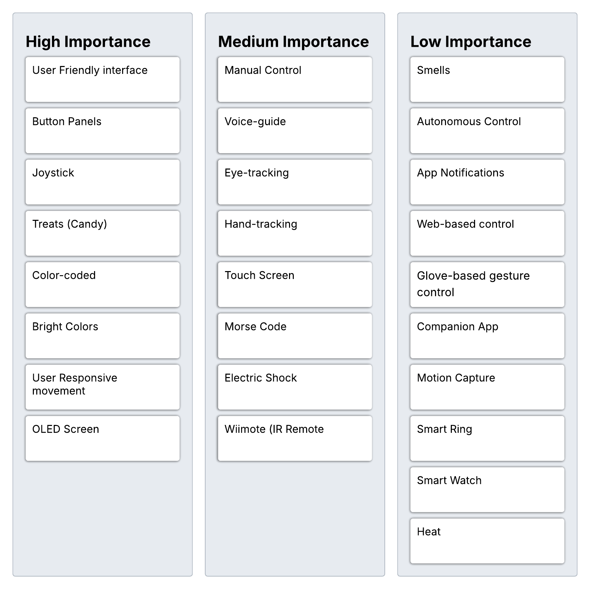{style width:"350" height:"300;"}
**Figure 2** User Interface & Control 
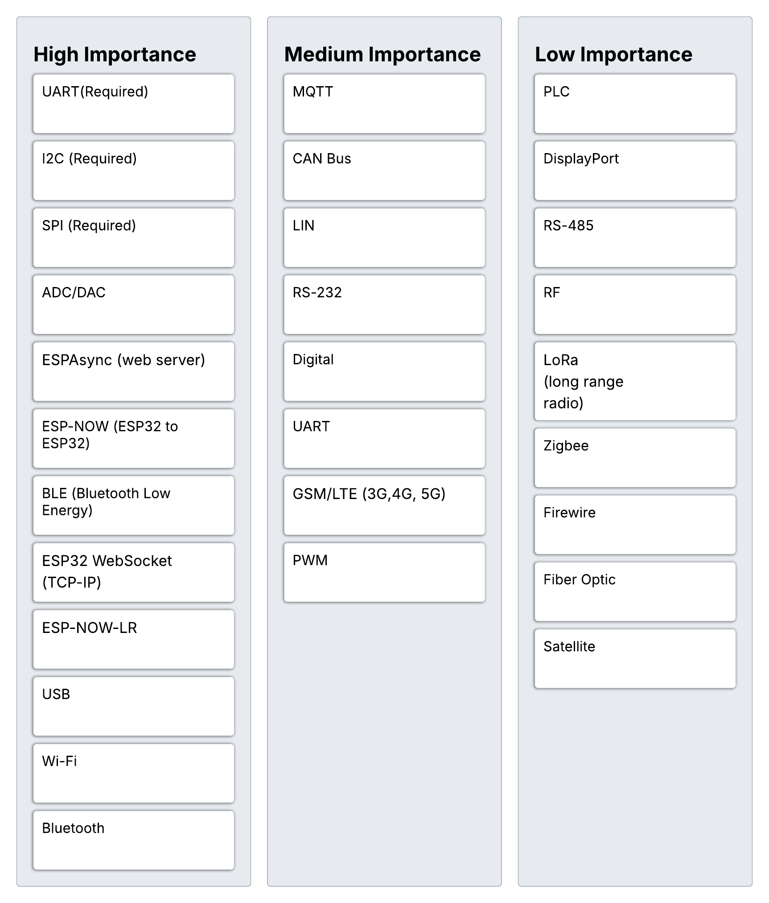{style width:"350" height:"300;"}
**Figure 3** Communication Technologies
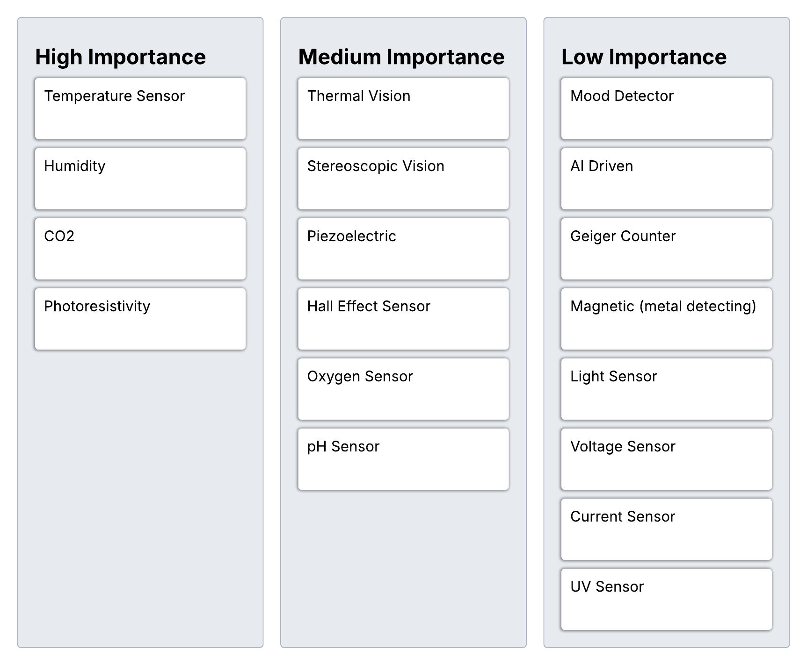{style width:"350" height:"300;"}
**Figure 4** Detection & Measurement
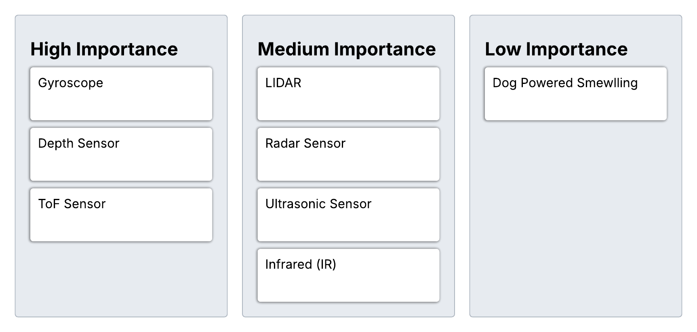{style width:"350" height:"300;"}
**Figure 5** Navigation & Hazard Avoidance
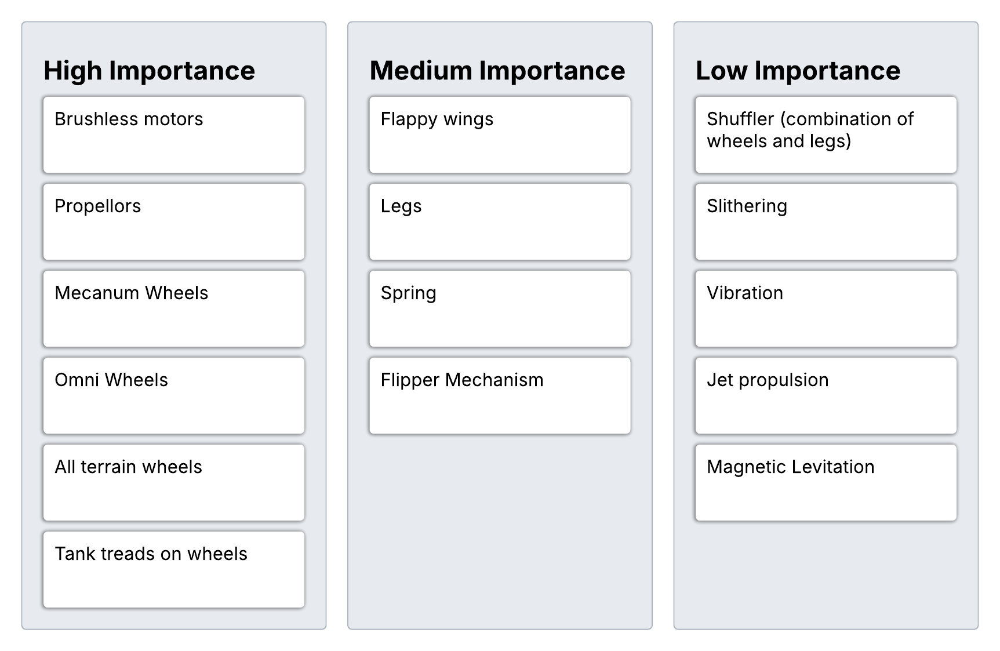{style width:"350" height:"300;"}
**Figure 6** Movement Mechanisms
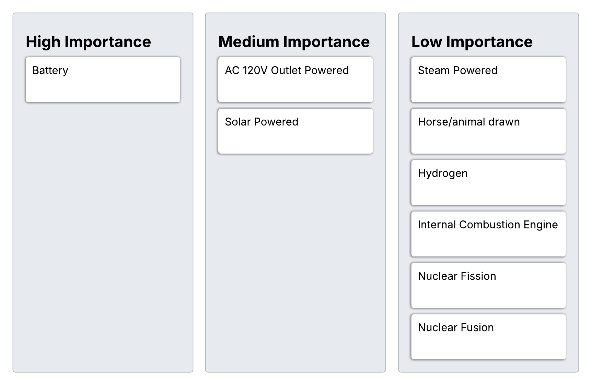{style width:"350" height:"300;"}
**Figure 7** Power Sources
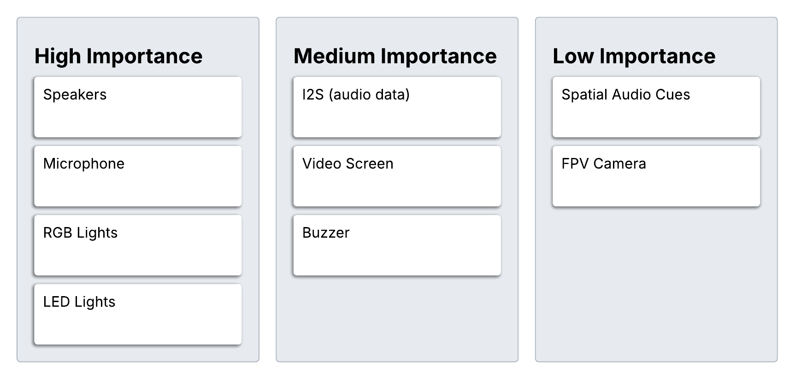{style width:"350" height:"300;"}
**Figure 8** Audio & Visual Features

## Concept Generation

From our features, we generated 3 concepts to choose from for us to develop (). While generating our concepts, we realized we missed some features that we should have come up with earlier. Some of the features we added during concept generation are Microphone, Camera, Flipper mechanism, and OLED Screen.

After looking through our highest priority features, we decided on a Search and Rescue Drone; an Underwater Exploration Drone; and a Quadcopter Drone for our concepts. We kept the Human Machine Interface and Wireless the same for each concept as we believe those are the best communication protocols for building our prototype.

In the charts below, the Rectangle boxes represent subsystems for each concept and the Oval boxes represent the features used in each subsytem. 

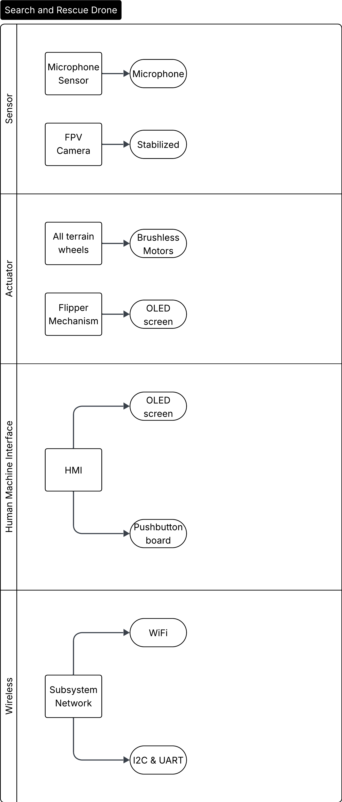{style width:"350" height:"300;"}
**Figure 9** Search and Rescue Drone Chart
{style width:"350" height:"300;"}
**Figure 10** Underwater Exploration Drone Chart
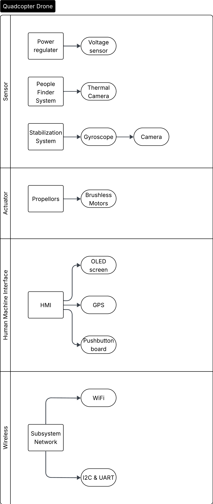{style width:"350" height:"300;"}
**Figure 11** Quadcopter Drone Chart

## Concept Sketches

## Chosen Concept