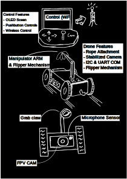
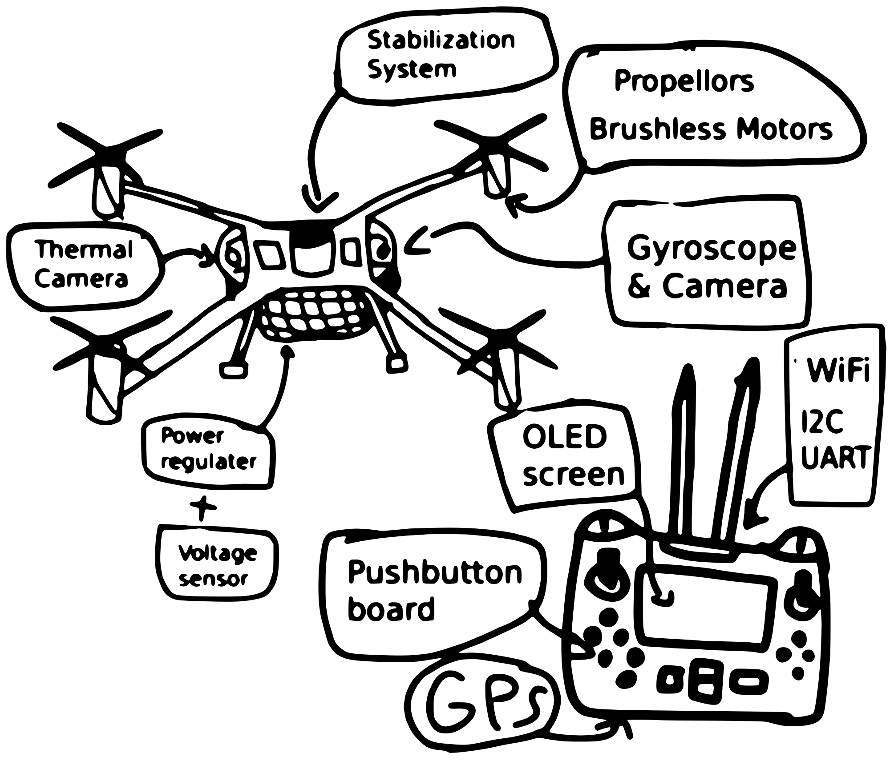

## Goal and Audience

The goal of our exploration device is to bring innovative and unique solutions to already existing problems to make them stand out while improving efficiency for those using it. Our solution would also have to adhere to the course requirements. We plan on making our device easy to deploy and operate while making it inexpensive to purchase and operate. 

Our audience are first responders, scientists, researchers, the military, and the people responsible for purchasing exploration robots in all of those fields. Focusing on these professions allows us to choose from a wide variety of robots that meets our class requirements. 

## Initial Concept Generation

At the beginning, we came up with a bunch of different concepts without taking into mind all of the requirements for this assignment. Once we finished this board (Figure 0). We moved onto idea generation after completing this board.

{style width:"100" height:"100;"}
**Figure 0** Whiteboard of concepts related exploratory devices

## Idea Generation

To generate ideas and features, we came up with 4 broad categories that we could fill up (Figure 1). These include Sensors; Movement/Power; Asthetics, User Attention & Human Control; and Communication. We felt like these categories did a good job of encompassing the features of an exploration device.  

We used the software Lucidchart/Lucidspark as a whiteboard tool to display our brainstormed ideas, because this software is easy to collaborate remotely and has many different formats and tools in which ideas can be displayed.

**Figure 1** Whiteboard of initial feature brainstorming

## Sorting and Ranking

Once the general brainstorming of features and ideas was complete. We figured that the 4 broad categories chosen at the start weren't enough to show each part necessary to make a functioning exploration device. To solve this, we divide the 4 categories we had into 7 new ones (Figure 2-8). These are User Interface and Control; Communication Technologies; Detection & Measurement; Navigation & Hazard Avoidance; Movement Mechanics; Power Sources; and Audio & Visual Features. 

After moving our features into the new categories, we then ranked each feature in terms of high, medium, and low importance. Doing this excersice showed us that most of our new categories made sense for the general device concept we are generating. However, the Power Sources category was not as useful due to the lack of variety in easily accesible mobile power sources. So we will most likely use a battery in the finished product.

**Figure 2** User Interface & Control 

**Figure 3** Communication Technologies

**Figure 4** Detection & Measurement

**Figure 5** Navigation & Hazard Avoidance

**Figure 6** Movement Mechanisms

**Figure 7** Power Sources

**Figure 8** Audio & Visual Features

## Concept Generation

From our features, we generated 3 concepts to choose from for us to develop (Figures 9-11). While generating our concepts, we realized we missed some features that we should have come up with earlier. Some of the features we added during concept generation are Microphone, Camera, Flipper mechanism, and OLED Screen.

After looking through our highest priority features, we decided on a Search and Rescue Drone; an Underwater Exploration Drone; and a Quadcopter Drone for our concepts. We kept the Human Machine Interface and Wireless the same for each concept as we believe those are the best communication protocols for building our prototype.

In the charts below, the Rectangle boxes represent subsystems for each concept and the Oval boxes represent the features used in each subsytem. 

**Figure 9** Search and Rescue Drone Chart

**Figure 10** Underwater Exploration Drone Chart

**Figure 11** Quadcopter Drone Chart

## Concept Sketches

Here are vector sketches for each concept we created (Figures 12-14).

 
**Figure 12** Ground Search & Rescue Drone vector sketch

The ground rescue drone will serve as a tool to aid seach and rescue crews when attempting to locate missing persons in emergency situations. The drone features a microphone sensor, a first person camera with stabilization, a manipularor and flipper arm to traverse obstacles, manipulate small objects, and flip over the drone when needed, and a rope attachement for ease of recovery of the unit in case of traversal of small crawl spaces. 

>The drone will communicate to its control tablet via a WiFi network, while internal microcontrollers will communicate locally via I2C and UART. The control mechanism features an oled screen for vibrant colors and push button controls to easily control the drone. 

The drone comes in a four wheel version and a two wheel version in case a more compact casing is needed for the task at hand.

 
**Figure 13** Underwater Exploration Drone vector sketch

The Underwater Exploration Drone is a small drone made to explore and inspect underwater areas. It has a front camera and a bright flashlight so we can see clearly in dark water, along with depth and pressure sensors that help track how deep it is and keep it operating safely. Inside the drone, a built in network system connects the sensors and motors using simple communication links. The drone moves using a motor and propeller, with steering fins to help it turn smoothly, and its strong waterproof body makes it useful for research and inspections.

 
**Figure 14** Quadcopter Exploration Drone vector sketch

The Quadcopter drone will be designed to locate people who are lost in the wilderness. It will accomplish this by utilizing a thermal camera for tracking. It will also have an onboard gyroscope and voltage sensor to stabilize the system and regulate power. Controlling the quadcopter will be accomplished through a WIFI connection and GPS to help navigate. The drone will have an onboard screen and buttons to debug and display information. The drone will be easy to use due to having a live video feed from the camera.
## Chosen Concept  
**Ground Search & Rescue Drone**

After researching the available offerings, we felt that the ground drone was the option with a greater opportunity for innovation. We looked at aerial search and rescue drones, and while this concept offered a challenge since it would be a flying drone, we saw that the market was already saturated with many payload capable rescue and law enforcement drones. In the other hand, the underwater drone would have been a challenge as well, the team ultimately chose the ground drone since we felt we could bring more fresh ideas into a market with limited offerings.

 
