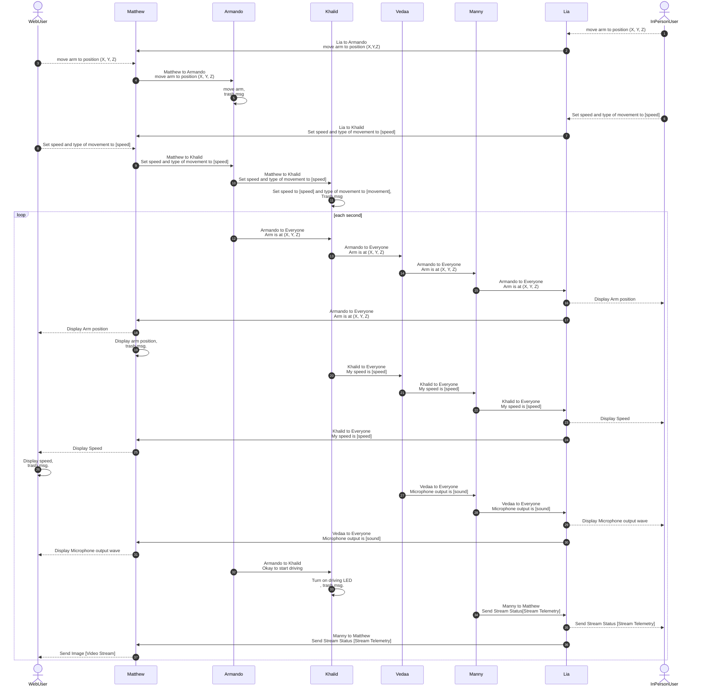

## Block Diagram

## Process Diagram

## Message Types
_Table 1: All message types and descriptions_
| Message type byte 1-2 (uint16_t) | Description |
| --- | --- |
| 1 | Arm position X, Y, and Z |
| 2 | Armando: arm position X, Y, and Z |
| 3 | Speed and movement type (forward, backward, turn left, turn right, or stop represented by 1 byte integer) |
| 4 | Khalid: my speed and movement type |
| 5 | Video feed stream information |
| 6 | Microphone audio stream information |
| 7 | Speaker audio # that corresponds to sound effect file on audio player (STRETCH GOAL) |

_Message Type 1: Arm XYZ position to Armando_ 

| Byte 1-2 (uint16_t) | Byte 3(uint8_t) | Byte 4(uint8_t) | Byte 5(uint8_t) |
| --- | --- | --- | --- |
| 1 | X (uint8_t) | Y (uint8_t) | Z (uint8_t) |

_Message Type 2: Arm XYZ position from Armando to HMI display and Webuser_

| Byte 1-2 (uint16_t) | Byte 3(uint8_t) | Byte 4(uint8_t) | Byte 5(uint8_t) |
| --- | --- | --- | --- |
| 2 | X (uint8_t) | Y (uint8_t) | Z (uint8_t) |

_Message Type 3: Speed and movement type to Khalid_

| Byte 1-2 (uint16_t) | Byte 3(uint8_t) | Byte 4(uint8_t) |
| --- | --- | --- |
| 3 | speed (uint8_t) | type (uint8_t) |

_Message type 4: Speed and movement type from Khalid to HMI display and webuser_

| Byte 1-2 (uint16_t) | Byte 3(uint8_t) | Byte 4(uint8_t) |
| --- | --- | --- |
| 4 | speed (uint8_t) | type (uint8_t) |

_Message type 5: Video feed stream information_

| Byte 1-2 (uint16_t) | Byte 3-58(char) |
| --- | --- |
| 5 | video_info_string |

_Message type 6: Microphone audio feed stream information_

| Byte 1-2 (uint16_t) | Byte 3-4 (uint16_t) |
| --- | --- |
| 6 | audio (uint16_t) |

_Message type 7: Speaker audio # (STRETCH GOAL)_

| Byte 1-2 (uint16_t) | Byte 3 (uint8_t) |
| --- | --- |
| 7 | audio # (uint8_t) |