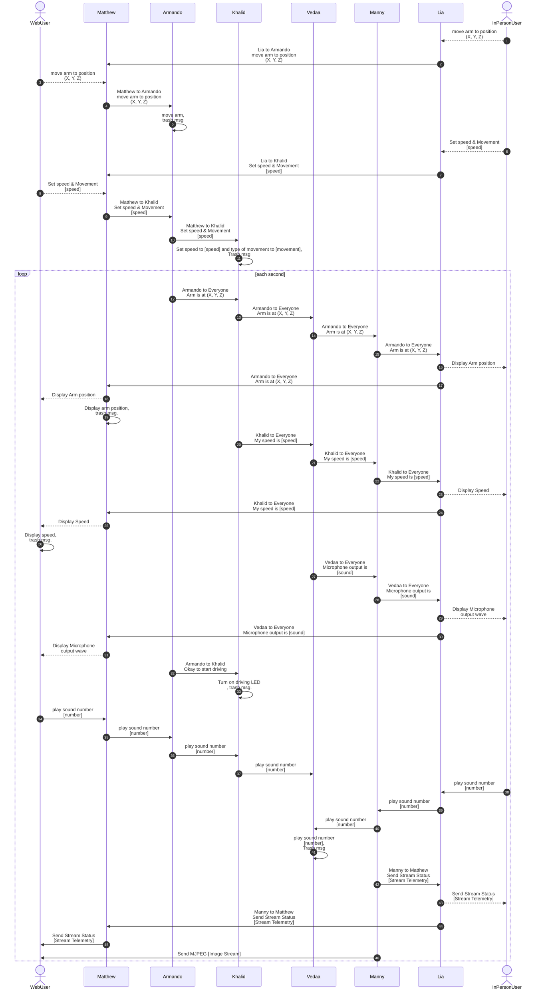

## Block Diagram

## Process Diagram

```mermaid
%%{init: {'themeVariables': { 'fontSize': '30px'}}}%%
sequenceDiagram
    actor WebUser
    participant MS as Matthew
    participant A as Armando
    participant K as Khalid
    participant V as Vedaa
    participant MC as Manny
    participant L as Lia
    actor InPersonUser
autonumber
    InPersonUser-->>L: move arm to position<br>(X, Y, Z)
    L->>MS: Lia to Armando<br>move arm to position<br>(X, Y, Z)
    WebUser-->>MS: move arm to position<br>(X, Y, Z)
    MS->>A: Matthew to Armando<br>move arm to position<br>(X, Y, Z)
    A->>A: move arm,<br> trash msg
    InPersonUser-->>L: Set speed & Movement<br>[speed]
    L->>MS: Lia to Khalid<br>Set speed & Movement<br>[speed]
    WebUser-->>MS: Set speed & Movement<br>[speed]
    MS->>A: Matthew to Khalid<br>Set speed & Movement<br>[speed]
    A->>K: Matthew to Khalid<br>Set speed & Movement<br>[speed]
    K->>K: Set speed to [speed] and type of movement to [movement],<br>Trash msg
    loop each second
     A->>K: Armando to Everyone<br>Arm is at (X, Y, Z)
    K->>V: Armando to Everyone<br>Arm is at (X, Y, Z)
    V->>MC: Armando to Everyone<br>Arm is at (X, Y, Z)
    MC->>L: Armando to Everyone<br>Arm is at (X, Y, Z)
    L-->>InPersonUser: Display Arm position
    L->>MS: Armando to Everyone<br>Arm is at (X, Y, Z)
    MS-->>WebUser: Display Arm position
    MS->>MS: Display arm position,<br> trash msg.
    K->>V: Khalid to Everyone<br>My speed is [speed]
    V->>MC: Khalid to Everyone<br>My speed is [speed]
    MC->>L: Khalid to Everyone<br>My speed is [speed]
    L-->>InPersonUser: Display Speed
    L->>MS: Khalid to Everyone<br>My speed is [speed]
    MS-->>WebUser: Display Speed
    WebUser->>WebUser: Display speed,<br> trash msg.
      V->>MC: Vedaa to Everyone<br>Microphone output is<br>[sound]
      MC->>L: Vedaa to Everyone<br>Microphone output is<br>[sound]
      L-->>InPersonUser: Display Microphone<br>output wave
      L->>MS: Vedaa to Everyone<br>Microphone output is [sound]
      MS-->>WebUser: Display Microphone<br>output wave
    A->>K: Armando to Khalid<br>Okay to start driving
    K->>K: Turn on driving LED<br>, trash msg.
    WebUser->>MS: play sound number<br>[number]
    MS->>A: play sound number<br>[number]
    A->>K: play sound number<br>[number]
    K->>V: play sound number<br>[number]
    InPersonUser->>L: play sound number<br>[number]
    L->>MC: play sound number<br>[number]
    MC->>V: play sound number<br>[number]
    V->>V: play sound number<br>[number],<br>Trash msg
    MC->>L: Manny to Matthew<br>Send Stream Status<br>[Stream Telemetry]
    L-->>InPersonUser: Send Stream Status<br>[Stream Telemetry]
    L->>MS: Manny to Matthew<br>Send Stream Status<br>[Stream Telemetry]
    MS->>WebUser: Send Stream Status<br>[Stream Telemetry]
    MC->>WebUser: Send MJPEG [Image Stream]
    end


```

## Message Structure

