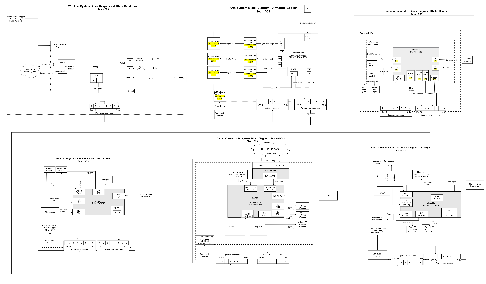
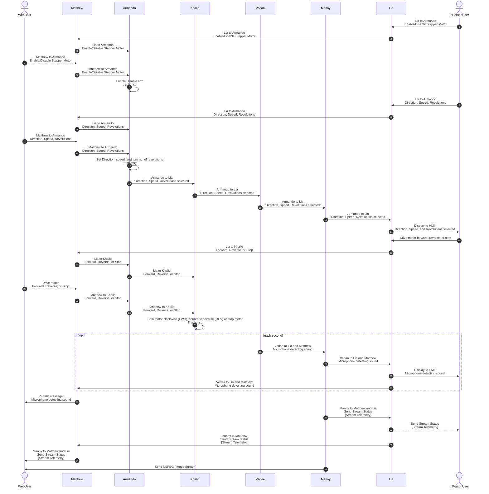

## Block Diagram

### Communication Structure
The functionality of our communication sequence diagram satisfies the product requirements of being in a loop and using UART to communicate between subsystems. It meets user needs by allowing for commands to control the robot be sent from the human machine interface on the robot, as well as remotely through Wi-Fi.

### Decision Making Process
The decision making process of our message structure was to match the structure wanted by the class and have the command messages be as simple as possible. We wanted commands to be as simple as possible so that the messages take less time to send.

### Top 5 Changes
We made relatively few changes to the overall software design compared to the original implementation. The primary modifications involved simplifying the command structure by condensing commands to single-character identifiers and introducing “X” as a destination to indicate that a message is intended for all subsystems.

Additionally, the message body format was changed from strings to byte arrays. This adjustment streamlined the process of transmitting complete messages as a single array rather than as individual bytes, which also improved debugging efficiency.

On the hardware side, the stepper motor subsystem was simplified to support a single stepper motor rather than the more complex robot arm configuration originally planned, which would have required four stepper motors. This change was necessary due to limitations in the final PCB design for the subsystem.

We also removed the speaker from Vedaa’s microphone subsystem and eliminated the distance sensors from Manny’s Camera Sensor Subsystem. These decisions were made to ensure the project could be completed within the available timeframe.

Finally, Khalid’s message structure was revised from supporting variable speed control to a simplified command set consisting of forward, stop, and reverse operations. This change aligned with the final capabilities of the subsystem, which did not include speed control functionality.

## Process Diagram

### Overview

The Process Diagram for our Drone Project is shown below. This diagram displays the what data will be sent, through UART protocol, around the subsystems and where it is intended to go.

## Message Types
### Overview:
All message type structure is described by the following:

    ---
    config:
    packet:
        bitsPerRow: 16
        bitWidth: 64
    ---
    packet-beta
    title Message
    0: "0x41"
    1: "0x5a"
    2: "Source ID"
    3: "Dest ID"
    4-61: "Message (Variable Length <= 58 Bytes)"
    62: "0x59"
    63: "0x42"
Byte 0 and 1 signify the start of the message and and 62 and 63 signify the end. Each board will receive messages on the UART chain but will only process it if byte 2: "source ID" matches theirs. If a board receives the a message that was intended for it, it will read the first bit of the message, byte 4, to determine which type of message it is, and use that info to carry out the command described in the following table using the remaining bytes of the message (bytes 5-61).

_Table 1: All message types and descriptions_

| Message type | Description |
| --- | --- |
| 1 | Enable/Disable Robot Arm |
| 2 | Robot arm stepper motor direction, speed, and revolutions |
| 3 | Robot arm direction, speed, and revolutions mode selected |
| 4 | Drive motor Forward, Reverse, or Stop |
| 5 | Video feed stream information |
| 6 | Microphone audio stream information |

_Message Type 1: Enable/Disable Robot Arm_ 

| Byte 1 (bytearray) | 
| --- |
| On/Off |

_Message Type 2: Robot arm stepper motor direction, speed, and revolutions_

| Byte 1 (bytearray) | Byte 2(bytearray) | Byte 3(bytearray) |
| --- | --- | --- |
| Direction | Speed in steps/second | Revolutions |

_Message Type 3: Robot arm direction, speed, and revolutions mode selected_

| Byte 1-32 (bytearray) |
| --- |
| "Robot arm direction, speed, and revolutions mode selected" represented by 16 characters |

_Message type 4: Drive motor Forward, Reverse, or Stop_

| Byte 1 (bytearray) |
| --- |
| Forward (1), reverse (2), or stop (3) |

_Message type 5: Video feed stream information_

| Byte 1-32 (bytearray) |
| --- |
| FPS, Resolution, and Stream Status |

_Message type 6: Microphone audio stream information_

| Byte 1 (bytearray) |
| --- |
| Mic on/off |
