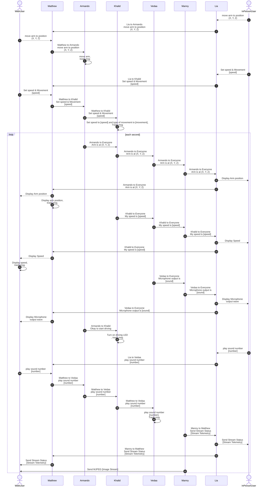

## Block Diagram

## Process Diagram

### Overview

The Process Diagram for our Drone Project is shown below. This diagram displays the what data will be sent, through UART protocol, around the subsystems and where it is intended to go.

## Message Types
### Overview:
All message type structure is described by the following:

    ---
    config:
    packet:
        bitsPerRow: 16
        bitWidth: 64
    ---
    packet-beta
    title Message
    0: "0x41"
    1: "0x5a"
    2: "Source ID"
    3: "Dest ID"
    4-61: "Message (Variable Length <= 58 Bytes)"
    62: "0x59"
    63: "0x42"
Byte 0 and 1 signify the start of the message and and 62 and 63 signify the end. Each board will receive messages on the UART chain but will only process it if byte 2: "source ID" matches theirs. If a board receives the a message that was intended for it, it will read the first bit of the message, byte 4, to determine which type of message it is, and use that info to carry out the command described in the following table using the remaining bytes of the message (bytes 5-61).

_Table 1: All message types and descriptions_

| Message type byte 1 (uint8_t) | Description |
| --- | --- |
| 1 | Arm position X, Y, and Z |
| 2 | Armando: arm position X, Y, and Z |
| 3 | Speed and movement type (forward, backward, turn left, turn right, or stop represented by 1 byte integer) |
| 4 | Khalid: my speed and movement type |
| 5 | Video feed stream information |
| 6 | Microphone audio stream information |
| 7 | Speaker audio # that corresponds to sound effect file on audio player (STRETCH GOAL) |

_Message Type 1: Arm XYZ position to Armando_ 

| Byte 1 (uint8_t) | Byte 3(uint8_t) | Byte 4(uint8_t) | Byte 5(uint8_t) |
| --- | --- | --- | --- |
| 1 | X (uint8_t) | Y (uint8_t) | Z (uint8_t) |

_Message Type 2: Arm XYZ position from Armando to HMI display and Webuser_

| Byte 1 (uint8_t) | Byte 3(uint8_t) | Byte 4(uint8_t) | Byte 5(uint8_t) |
| --- | --- | --- | --- |
| 2 | X (uint8_t) | Y (uint8_t) | Z (uint8_t) |

_Message Type 3: Speed and movement type to Khalid_

| Byte 1 (uint8_t) | Byte 3(uint8_t) | Byte 4(uint8_t) |
| --- | --- | --- |
| 3 | speed (uint8_t) | type (uint8_t) |

_Message type 4: Speed and movement type from Khalid to HMI display and webuser_

| Byte 1 (uint8_t) | Byte 3(uint8_t) | Byte 4(uint8_t) |
| --- | --- | --- |
| 4 | speed (uint8_t) | type (uint8_t) |

_Message type 5: Video feed stream information_

| Byte 1 (uint8_t) | Byte 3-58(char) |
| --- | --- |
| 5 | video_info_string |

_Message type 6: Microphone audio feed stream information_

| Byte 1 (uint8_t) | Byte 3-4 (uint16_t) |
| --- | --- |
| 6 | audio (uint16_t) |

_Message type 7: Speaker audio # (STRETCH GOAL)_

| Byte 1 (uint8_t) | Byte 3 (uint8_t) |
| --- | --- |
| 7 | audio # (uint8_t) |