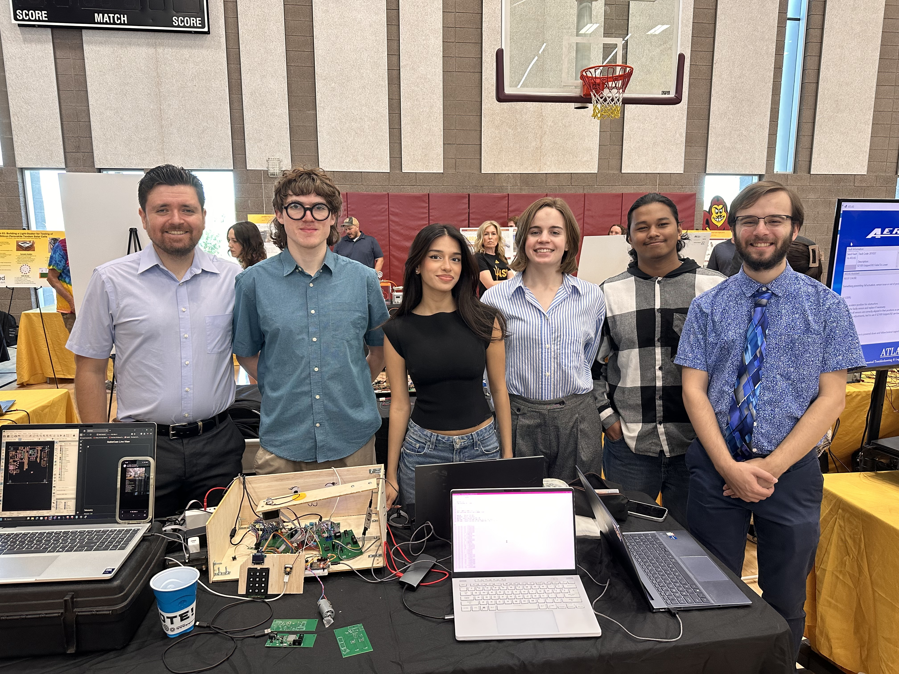

SABLE 
Team 303 
**Submission: March, 06, 2026** 
Spring - 2026 
Arizona State University 
**EGR 314** 
Kevin Nichols 
  

## Team

## Team Introduction
Greetings. We are Team 303 and our project, SABLE, is meant to be a WIFI controlled ground exploration/rescue bot with an arm and grabber attached for sample collection. 

To follow our design process and understand the technical as well as physical requirements and features, look no further than our [Project-Requirements](https://egr314-s-2026-303.github.io/03-Project-Requirements/Project-requirements/) and [Concept Generation and Design Ideation](https://egr314-s-2026-303.github.io/02-Concept-Design/Design/) page.

Our design features a series of daisy-chained boards meant to control different parts of the robot. More info can be found in our [Team Block Diagram, Process Diagram, and Message Structure](https://egr314-s-2026-303.github.io/04-Team-Block-Diagram%2C-Process-Diagram%2C-and-Message-Structure/Team-Diagram/) page.

In our appendix you may find our [Team Organization Information](https://egr314-s-2026-303.github.io/Appendix/01-Organization-Information/Append-Organization/) page which tells more about our team collaboration methods more.

## Project Summary
Overall the project was a success. We got everyones subsystem functional. There were many hiccups along the way with multiple team members needing to update their PCB and order a new one. The design of our project ended up being one subsystem to control the drive train, one to control the manipulator, one as a sound sensor, one as a camera, one as the human machine interface, and one as the Wi-Fi connection.

## Team Members Datasheet links

| **Team Member**        |**Ind Datasheet Links** |
| ---------------------- | -----------------------|
| Armando Botiller       | [Armando Botiller's github](https://botilarm.github.io/) |
| Lia Ryan               | [Lia Ryan's Github](https://lryan5.github.io/) |
| Matthew Sanderson      | [Matthew Sanderson Github](https://msande84.github.io/msande84.EGR314.github.io/) |
| Khalid Hamdan          | [Khalid Hamdan Github](https://khamdan24.github.io/khamdan2.github.io/) |
| Manuel Castro          | [Manuel Castro's GitHub](https://mcastr11-collab.github.io/EGR314MannyDataSheet/) |
| Vedaa Ubale            | [Vedaa Ubale's Github](https://vedaau.github.io/sable) | 
