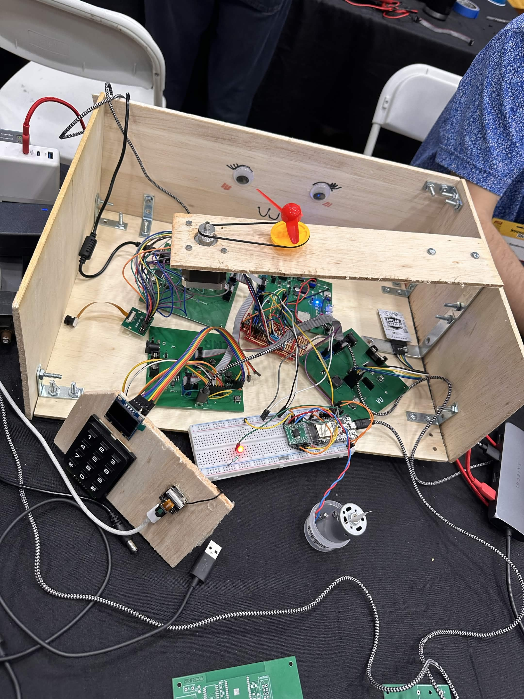

SABLE 
Team 303 
**Submission: May, 04, 2026** 
Spring - 2026 
Arizona State University 
**EGR 314** 
Kevin Nichols 
  

## Team Introduction
Greetings. We are Team 303 and our project, SABLE, is meant to be a WIFI controlled ground exploration/rescue bot with an arm and grabber attached for sample collection. 

To follow our design process and understand the technical as well as physical requirements and features, look no further than our [Project-Requirements](https://egr314-s-2026-303.github.io/03-Project-Requirements/Project-requirements/) and [Concept Generation and Design Ideation](https://egr314-s-2026-303.github.io/02-Concept-Design/Design/) page.

Our design features a series of daisy-chained boards meant to control different parts of the robot. More info can be found in our [Team Block Diagram, Process Diagram, and Message Structure](https://egr314-s-2026-303.github.io/04-Team-Block-Diagram%2C-Process-Diagram%2C-and-Message-Structure/Team-Diagram/) page.

In our appendix you may find our [Team Organization Information](https://egr314-s-2026-303.github.io/Appendix/01-Organization-Information/Append-Organization/) page which tells more about our team collaboration methods more.

## Project Summary
Our project was intended to be a ground level exploration robot that can be controlled remotely, collect and deposit samples for testing, and receive data from the outside world.
Overall the project was a success. Everyone's subsystem was functional despite the difficulties along the way with multiple team members needing to update PCBs and order new ones, and add additional functionality not present in the initial PCB design.

The design of our project comprised of six subsystems across six teammates: the Human Machine Interface(HMI), robot drive, robot arm, microphone, camera, and Wi-Fi control.

The subsystems all communicated using UART RX and TX lines with a specified message structure and message types for each teammate so that each can be controlled using serial communication from the HMI or WiFi interface. This is so that the final robot can be controlled remotely for exploration and directly using a keypad for debugging purposes.

## Team Members Datasheet links

| **Team Member**        |**Subsystem**| **Ind Datasheet Links** |
| ---------------------- |-------------| -----------------------|
| Armando Botiller       | Robot Arm   | [Armando Botiller's github](https://botilarm.github.io/) |
| Lia Ryan               | HMI         | [Lia Ryan's Github](https://lryan5.github.io/) |
| Matthew Sanderson      | Wi-Fi       | [Matthew Sanderson Github](https://msande84.github.io/msande84.EGR314.github.io/) |
| Khalid Hamdan          | Robot Drive | [Khalid Hamdan Github](https://khamdan24.github.io/khamdan2.github.io/) |
| Manuel Castro          | Camera      | [Manuel Castro's GitHub](https://mcastr11-collab.github.io/EGR314MannyDataSheet/) |
| Vedaa Ubale            | Microphone  | [Vedaa Ubale's Github](https://vedaau.github.io/sable) | 
